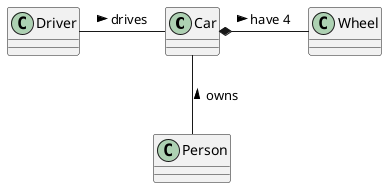

# Student information system - SCHEDULE

Modul rozvrhy slouží k vytváření a prohlížení rozvrhů. V rámci modulu jsou vedeny předměty a jejich příslušnost do studijních programů a jednotlivých semestrů studia, ve kterých jsou v rámci programu doporučeny. Dále jsou v rámci modulu vedeny učebny pro výuku a jejich kapacita. Pro každý předmět jsou evidovány rozvrhové lístky přednášek a cvičení, včetně jejich kapacit a vyučujících. Modul umožňuje rozvrhové komisi v jednotlivých semestrech vytváření centrálních rozvrhů přiřazováním rozvrhových lístků k učebnám na konkrétní den v týdnu a hodinu. Předměty ve stejném studijním programu a semestru musí být rozvrhovány tak, aby měli studenti v daném studijním programu a semestru možnost tyto předměty navštěvovat. Dále nesmí docházet k časovým kolizím jednoho učitele. Modul umožňuje vytvářet statistické reporty o vytíženosti místností v jednotlivých semestrech. 

## Functional Requirements

Tato sekce obsahuje funčkní požadavky.

### User requirements
Jan J.
{

}

Jan S. 
{

}

Jára
---
    - Jako student, chci být schopen si zobrazit mnou zapsané rozvrhové lístky pro daný semestr, protože potřebuji vidět, zda-li se některé nepřekrývají.
    - Jako student, chci být schopen si zobrazit předměty z mého studijního plánu, protože tyto předměty si budu primárně zapisovat.
    - Jako student, chci být schopen si zobrazit detail daného rozvrhového lístku, protože potřebuji vidět detaily ohledně času, vyučujícím a místa konání.
    - Jako student, chci být schopen se odepsat daný rozvrhový lístek, protože může kolidovat s jiným lístkem.
    - Jako student, chci být schopen si zobrazit všechny rozvrhové lístky pro daný předmět, protože mi to pomůže si vybrat ten, který mi nejvíce vyhovuje.
    - Jako student, chci být schopen si zobrazit povinné předměty pro mou specializaci, protože ty musím za své studium splnit.
    - Jako student, chci být schopen si zobrazit povinně volitelné předměty, protože z nich musím určitou část splnit.
    - Jako učitel, chci být schopen si zobrazit mnou vyučované rozvrhové lístky pro daný semestr, protože si potřebuji podle toho naplánovat pracovní dobu.
    - Jako učitel, chci být schopen si zobrazit detail rozvrhového lístku, abych se mohl podívat například na místo konání.
    - Jako učitel, chci mít možnost modifikovat mnou vyučovaný rozvrhový lístek, protože někdy chci např. navýšit kapacitu.
    - Jako člen rozvrhové komise, chci mít možnost vidět všechny rozvrhové lístky pro daného učitele, protože učitel může učit v jedné budově a přesun do jiné budovy trvá určitý čas.
    - Jako člen rozvrhové komise, chci mít možnost vidět rozvrhové lístky pro daný předmět, protože potřebují mít přehled o jejich rozložení.
    - Jako člen rozvrhové komise, chci mít možnost vidět všechny rozvrhové lístky pro všechny předměty doporučené pro daný ročník, protože musím zajistin, aby studenti mohli chodit na všechny předměty doporučeného plánu. 
    - Jako člen rozvrhové komise, chci mít možnost modifikovat roizvrhové lístky, protože občas je potřeba změnit čas, vyučujícího, místo konání, kapacitu atd. 
---

####Kryštof
 - Coby správce budov chci mít možnost generovat a prohlížet reporty o stavu vytížení místností, protože to potřebuji k úkonům jako plánování úklidu či údržby apod.
 - Coby učitel chci mít možnost zobrazit si rozvrhové lístky podle místnosti, abych mohl plánovat mimořádné schůzky, předtermínové zkoušky apod.
 - Coby student chci mít možnost prohlížet dostupné rozvrhové lístky a zapisovat si je, abych mohl řádně docházet na výuku
 - Coby student chci mít možnost upravovat si zápis rozvrhových lístků (přezapisovat, odhlašovat), abych si mohl v rámci možností sestavit rozvrh
 - Coby student chci mít možnost Zapsat si do rozvrhu k lístkům poznámky a vlastní virtuální lístky, abych mohl rozvrhový modul používat k plánování svých pracovních dní 

Nicol
{

}

### System requirements

#### Actors
 - Student
 - Učitel
 - Člen rozvrhové komise

##### Student
Student je osoba zapsaná na univerzitě, která aktivně studuje. Tedy zapisuje se na určité rozvrhové lístky v daném semestru. Zapisuje si jak povinné, tak i povinně volitelné a volitelné předměty. Může si také zapsat předměty z jiné fakulty, než na které současně studuje.

##### Učitel
Učitel je zaměstnanec univerzity, který se nějakým způsobem podílí na výuce. Má preference ohledně času, kdy může vyučovat. Také má preferenci ohledně toho, kolik rozvrhových lístků chce vyučovat.

##### Člen rozvrhové komise
Člen rozvrhové komise je zaměstnanec univerzity, jehož náplní práce je podílet se na tvorbě rozvrhů pro dané studijní plány, kontrola kolize mezi rozvrhovými lístky,
vytváření rozvrhových lístků dle preference učitelů atd.

#### Use cases

[*Document here all use cases. Create a subsection for each use case diagram. If you have only one use case diagram, you do not need a special subsection*]

##### [*Use case diagram title*]

[*Use case diagram in PlantUML*]

```plantuml
@startuml
left to right direction

@enduml
```

To be able to embed PlantUML diagrams to Markdown code with previews in VSCode you need
* Markdown All in One extension
* PlantUML extension
* Mardown Plantuml Preview extension

Follow https://plantuml.com/

[*Describe the diagram in a short paragraph. Describe each use case from the diagram in the detail from the lecture in a separate subsection.*]

###### [*Use case title*]

[*Use case description in the structure from the lecture.*]

[*Add an activity diagram for one use case per a team member*]

## Information model

[*Express the information model of the domain as a UML class diagram in PlantUML. Do not use class methods in the diagram, only classes, class attributes and associations connecting classes.*]



[*Document each class with a short description in a separate subsection*]

### [*Class name*]

[*Class description*]
