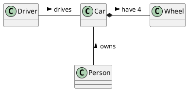

# Student information system - SCHEDULE

Modul rozvrhy slouží k vytváření a prohlížení rozvrhů. V rámci modulu jsou vedeny předměty a jejich příslušnost do studijních programů a jednotlivých semestrů studia, ve kterých jsou v rámci programu doporučeny. Dále jsou v rámci modulu vedeny učebny pro výuku a jejich kapacita. Pro každý předmět jsou evidovány rozvrhové lístky přednášek a cvičení, včetně jejich kapacit a vyučujících. Modul umožňuje rozvrhové komisi v jednotlivých semestrech vytváření centrálních rozvrhů přiřazováním rozvrhových lístků k učebnám na konkrétní den v týdnu a hodinu. Předměty ve stejném studijním programu a semestru musí být rozvrhovány tak, aby měli studenti v daném studijním programu a semestru možnost tyto předměty navštěvovat. Dále nesmí docházet k časovým kolizím jednoho učitele. Modul umožňuje vytvářet statistické reporty o vytíženosti místností v jednotlivých semestrech.  
 

## Functional Requirements
Tato sekce obsahuje funčkní požadavky.
 

### User requirements

Jakýkoli Uživatel
- zobrazit počty studentů zapsaných na předmětu
- zobrazit si statistický report
- zobrazit si seznam předmětů a rozvrhových lístků

Uživatel s rozvrhem
- Chci mít možnost exportovat si rozvrh v různých běžných formátech, abych si jej mohl importovat do svého kalendáře
- Chci být schopen zapsat si do rozvrhu k lístkům poznámky a vlastní virtuální lístky, abych mohl rozvrhový modul používat k plánování svých pracovních dní 

Student
- Chci být schopen si zobrazit mnou zapsané rozvrhové lístky pro daný semestr, protože potřebuji vidět, zda-li se některé nepřekrývají
- Chci být schopen si zobrazit předměty z mého studijního plánu, protože tyto předměty si budu primárně zapisovat
- Chci být schopen si zobrazit detail daného rozvrhového lístku, protože potřebuji vidět detaily ohledně času, vyučujícím a místa konání
- Chci být schopen si zobrazit všechny rozvrhové lístky pro daný předmět, protože mi to pomůže si vybrat ten, který mi nejvíce vyhovuje
- Chci být schopen si zobrazit povinné předměty pro mou specializaci, protože ty musím za své studium splnit
- Chci být schopen si zobrazit povinně volitelné předměty, protože z nich musím určitou část splnit
- Chci být schopen zobrazit si všehny předmety z mé fakulty i z jiných fakult, protože i na ty mám možnost se zapsat.
- Chci být schopen zapisovat si rozvrhové lístky, abych mohl řádně docházet na výuku
- Chci být schopen upravovat si zápis rozvrhových lístků (přezapisovat, odhlašovat), abych si mohl v rámci možností sestavit rozvrh
- Chci být schopen podívat se na rozvrh konkrétního učitele, abych se s ním mohl dohodnout na čase konzultace apod.
- Chci být schopen podívat se na rozvrh konkrétní učebny či učeben z jednoho areálu, abych si případně mohl naplánovat výuku podle areálu, kde zrovna jsem
- Chci být schopen zapisovat předměty do košíku, abych si mohl ideální rozvrh naplánovat před spuštěním zápisu
- Chci být schopen zapsat se pro naplněný čekací lístek na čekací listinu, aby mě systém zapsal sám, pokud se kapacita uvolní, a já tak nemusel samostatně kontrolovat, zda se tak stalo
- Chci být schopen zrušit svůj zápis v čekací listině, protože o lístek mohu přestat mít zájem

Učitel
- Chci být schopen si zobrazit mnou vyučované rozvrhové lístky pro daný semestr, protože si potřebuji podle toho naplánovat pracovní dobu.
- Chci být schopen si zobrazit detail rozvrhového lístku, abych se mohl podívat například na místo konání.
- Chci být schopen modifikovat mnou vyučovaný rozvrhový lístek, protože někdy chci např. navýšit kapacitu.
- Chci být schopen zobrazit si informace o místnosti, ve které učím, abych mohl plánovat výuku
- Chci být schopen zobrazit si studenty zapsané na rozvrhovém lístku, který vyučuji, abych podle toho případně mohl přizpůsobit výuku
- Chci být schopen připsat studenta na svůj rozvrhový lístek či ho z něj odepsat, a to i mimo std dobu zápisu, abych mohl například reflektovat individuální dohody se studenty
- Chci být schopen poslat hromadně zprávu včetně přílohy studentům ze svého rozvrhového lístku, abych jim mohl hromadně zasílat sdělení, změny, materiály z hodin apod.
- Chci být schopen možnost zobrazit si rozvrhové lístky podle místností, abych mohl plánovat mimořádné schůzky, předtermínové zkoušky apod.
- Chci být schopen zobrazit si rozvrh studenta, abych mohl dohodnut konzultaci/přesunout paralelku na jiný čas, pokud si to okolnosti vyžádají

Rozvrhový komisař
- zobrazit předměty podle studijních programů
- zobrazit místnosti a informace o nich
- zobrazit seznam učitelů pro daný předmět
- zobrazit seznam učitelů a místností, které jsou volné v určitý čas
- vytvořit/upravit/smazat rozvrhový lístek s daným dnem a časem, přiřadit k němu učitele, místnost, ...
- zobrazit rozvrh jednotlivých učitelů
- zobrazit rozvrhové lístky předmětu, info o nich

- Jako člen rozvrhové komise, chci mít možnost vidět všechny rozvrhové lístky pro daného učitele, protože učitel může učit v jedné budově a přesun do jiné budovy trvá určitý čas.
- Jako člen rozvrhové komise, chci mít možnost vidět rozvrhové lístky pro daný předmět, protože potřebují mít přehled o jejich rozložení.
- Jako člen rozvrhové komise, chci mít možnost vidět všechny rozvrhové lístky pro všechny předměty doporučené pro daný ročník, protože musím zajistin, aby studenti mohli chodit na všechny předměty doporučeného plánu. 
- Jako člen rozvrhové komise, chci mít možnost modifikovat roizvrhové lístky, protože občas je potřeba změnit čas, vyučujícího, místo konání, kapacitu atd. 

Správce budov
- vytížnost jednotlivých učeben

- Coby správce budov chci mít možnost generovat a prohlížet reporty o stavu vytížení místností, protože to potřebuji k úkonům jako plánování úklidu či údržby apod.

 

### System requirements

#### Actor list
 - Uživatel s rozvrhem
   - Student
   - Učitel
 - Rozvrhový komisař
 - Správce budov

 

Uživatel s rozvrhem  
Je uživatel systému, který má nějaký svůj rozvrh, se kterým může chtít nějak nakládat.

Student  
Student je osoba zapsaná na univerzitě, která aktivně studuje. Tedy zapisuje se na určité rozvrhové lístky v daném semestru. Zapisuje si jak povinné, tak i povinně volitelné a volitelné předměty. Může si také zapsat předměty z jiné fakulty, než na které současně studuje.

Učitel  
Učitel je zaměstnanec univerzity, který se nějakým způsobem podílí na výuce. Má preference ohledně času, kdy může vyučovat. Také má preferenci ohledně toho, kolik rozvrhových lístků chce vyučovat.

Rozvrhový komisař  
Člen rozvrhové komise je zaměstnanec univerzity, jehož náplní práce je podílet se na tvorbě rozvrhů pro dané studijní plány, kontrola kolize mezi rozvrhovými lístky,
vytváření rozvrhových lístků dle preference učitelů atd.

Správce budov  
Správce budov je zaměstnanec univerzity, který má nějakým způsobem na starosti/zodpovědnosti techicko-údržbářské práce na jedné či více univerzitních budov. Zajišťuje úklid, servis zařízení, výdej klíčů apod. 

 

### Use cases

#### Zápis na čekací listinu
- Starting situation:
Zacal sa zapis predmetov a nestihol som sa zapisat na rozvrhovy listok predmetu ktory som chcel pretoze sa rychlo naplnila kapacita.
Ked sa niekto odhlasi tak si zmenim rozvrhovy listok.
- Normal:
  1) Zapisem sa na iny - volny rozvrhovy listok 
  2) posle sa poziadavok na ulozenie info o zapisanom studentovi pre dany listok
  2) otvorim rozvrhovy listok ktory som povodne planoval zapisat
  3) kliknem na zapisat na cakaciu listinu - posle sa poziadavok
  4) system si niekam ulozi (na spravne poradie) cloveka pre dany listok
  5) system mi pri zbrazeni informacii o rozvrhovom listku bude ukazovat aktualnu kapacitu| pocet ludi na cakacke | moje poradie na cakacke
  6) system dynamicky meni informacie z bodu 4) podla chovania studentov..
  7) system pravidelne zkontroluje zmeny v ulozenych datach a ak pocet ludi ulozenych pre dany listok je < nez kapacita a niekto je na cakacej listine tak ho preradi
  8) aktualizuju sa ulozene data a zobrazovane info na stranke
  9) odosle sa email studentovi ktory bol preradeni z cakacej listiny
- What can go wrong:
  * clovek nieje zapisany na ziadny iny listok, v tom pripade ho upozornim aby sa zapisal na volny listok a neumoznim zapis na cakaciu listinu
  * clovek uz je zapisany na inej cakacej listine, vtedy ho odhlasim z povodnej cakacej listiny a prihlasim na novu 
- System state on completion:  
  Student je zapsany korektne na predmet - je zapsany na konkretny rozvrhovy listok a zaroven je priradeny na jedinu cakaciu listinu.

#### Zápis na předmět
- Počáteční stav
  - Student je přihlášen ke svému účtu v systému
- Normální situace
  - Student vyhledá předmět podle názvu, kódu, vyučujícího, ... a nebo ho nalezne na seznamu povinných předmětů pro jeho specializaci
  - Student si o předmětu zobrazí podrobnější informace včetně jeho rozvrhových lístků
  - Student po vybrání hlavního rozvrhového lístku (případně i sekundárního rozvrhového lístku pro cvičení) svůj výběr potvrdí
- Co se může pokazit
  - Požadovaný předmět není v daný semestr vyučován
  - Student nemá splněny prerekvizity
  - Požadovaný předmět má plnou kapacitu

#### Zobrazit zapsaných rozvrhových lístků pro daný semestr

- počáteční stav
  - Student je přihlášen ke svému účtu v systému

- normální situace
  - Student vyhledá předmět podle názvu, kódu, vyučujícího, ... a nebo ho nalezne na seznamu povinných předmětů pro jeho specializaci
  - Student si o rozvrhu zobrazí podrobnější informace
  - V případě, že se student rozhodne rozvrh změnit, je přesměrován na modul zápis

#### Zobrazení statistického reportu

- Počáteční stav
  - Uživatel je připojen do systému bez jakýchkoli speciálních oprávnění
- Normální situace
  - Uživatel si vyhledá předmět a vyžádá si od systému zobrazení podrobností
  - Systém načte z databáze a zobrazí uživateli podrobnosti o předmětu které obsahují i statistický report
- Po dokončení
  - Uživatel získá všechny informace ze statistického reportu předmětu

## Information model

[*Express the information model of the domain as a UML class diagram in PlantUML. Do not use class methods in the diagram, only classes, class attributes and associations connecting classes.*]

[*Document each class with a short description in a separate subsection*]

### [*Class name*]

[*Class description*]
