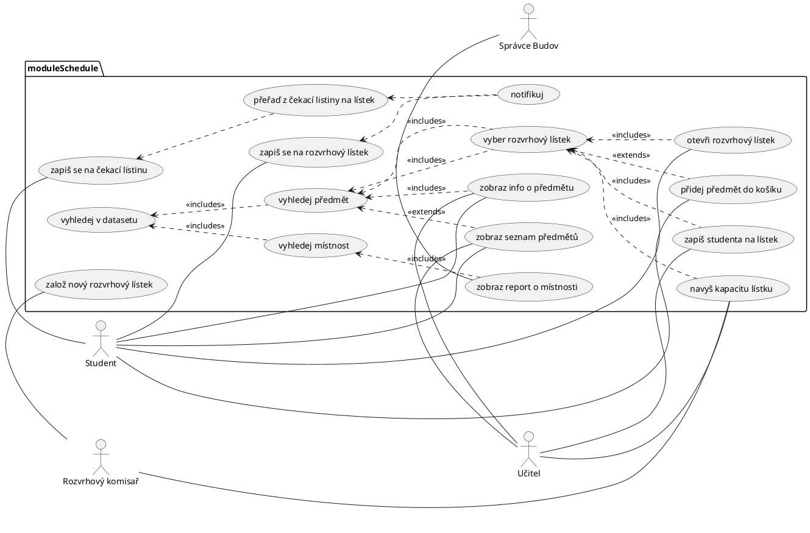
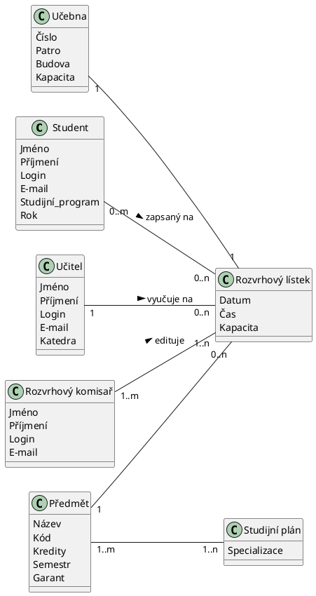

# Student information system - SCHEDULE

Modul rozvrhy slouží k vytváření a prohlížení rozvrhů. V rámci modulu jsou vedeny předměty a jejich příslušnost do studijních programů a jednotlivých semestrů studia, ve kterých jsou v rámci programu doporučeny. Dále jsou v rámci modulu vedeny učebny pro výuku a jejich kapacita. Pro každý předmět jsou evidovány rozvrhové lístky přednášek a cvičení, včetně jejich kapacit a vyučujících. Modul umožňuje rozvrhové komisi v jednotlivých semestrech vytváření centrálních rozvrhů přiřazováním rozvrhových lístků k učebnám na konkrétní den v týdnu a hodinu. Předměty ve stejném studijním programu a semestru musí být rozvrhovány tak, aby měli studenti v daném studijním programu a semestru možnost tyto předměty navštěvovat. Dále nesmí docházet k časovým kolizím jednoho učitele. Modul umožňuje vytvářet statistické reporty o vytíženosti místností v jednotlivých semestrech.  
 

## Functional Requirements
Tato sekce obsahuje funčkní požadavky.
 

### User requirements

Jakýkoli Uživatel
- Chci být schopen zobrazit si statistický report, abych mohl zjistit, co se děje u mě na škole
- Chci být schopen zobrazit si seznam předmětů a rozvrhových lístků, abych se mohl informovat, co se učí

Uživatel s rozvrhem
- Chci mít možnost exportovat si rozvrh v různých běžných formátech, abych si jej mohl importovat do svého kalendáře
- Chci být schopen zapsat si do rozvrhu k lístkům poznámky a vlastní virtuální lístky, abych mohl rozvrhový modul používat k plánování svých pracovních dní 

Student
- Chci být schopen si zobrazit mnou zapsané rozvrhové lístky pro daný semestr, protože potřebuji vidět, zda-li se některé nepřekrývají
- Chci být schopen si zobrazit předměty z mého studijního plánu, protože tyto předměty si budu primárně zapisovat
- Chci být schopen si zobrazit detail daného rozvrhového lístku, protože potřebuji vidět detaily ohledně času, vyučujícím a místa konání
- Chci být schopen si zobrazit všechny rozvrhové lístky pro daný předmět, protože mi to pomůže si vybrat ten, který mi nejvíce vyhovuje
- Chci být schopen si zobrazit povinné předměty pro mou specializaci, protože ty musím za své studium splnit
- Chci být schopen si zobrazit povinně volitelné předměty, protože z nich musím určitou část splnit
- Chci být schopen zobrazit si všehny předmety z mé fakulty i z jiných fakult, protože i na ty mám možnost se zapsat.
- Chci být schopen zapisovat si rozvrhové lístky, abych mohl řádně docházet na výuku
- Chci být schopen upravovat si zápis rozvrhových lístků (přezapisovat, odhlašovat), abych si mohl v rámci možností sestavit rozvrh
- Chci být schopen podívat se na rozvrh konkrétního učitele, abych se s ním mohl dohodnout na čase konzultace apod.
- Chci být schopen podívat se na rozvrh konkrétní učebny či učeben z jednoho areálu, abych si případně mohl naplánovat výuku podle areálu, kde zrovna jsem
- Chci být schopen zapisovat předměty do košíku, abych si mohl ideální rozvrh naplánovat před spuštěním zápisu
- Chci být schopen zapsat se pro naplněný čekací lístek na čekací listinu, aby mě systém zapsal sám, pokud se kapacita uvolní, a já tak nemusel samostatně kontrolovat, zda se tak stalo
- Chci být schopen zrušit svůj zápis v čekací listině, protože o lístek mohu přestat mít zájem

Učitel
- Chci být schopen si zobrazit mnou vyučované rozvrhové lístky pro daný semestr, protože si potřebuji podle toho naplánovat pracovní dobu.
- Chci být schopen si zobrazit detail rozvrhového lístku, abych se mohl podívat například na místo konání.
- Chci být schopen modifikovat mnou vyučovaný rozvrhový lístek, protože někdy chci např. navýšit kapacitu.
- Chci být schopen zobrazit si informace o místnosti, ve které učím, abych mohl plánovat výuku
- Chci být schopen zobrazit si studenty zapsané na rozvrhovém lístku, který vyučuji, abych podle toho případně mohl přizpůsobit výuku
- Chci být schopen připsat studenta na svůj rozvrhový lístek či ho z něj odepsat, a to i mimo std dobu zápisu, abych mohl například reflektovat individuální dohody se studenty
- Chci být schopen poslat hromadně zprávu včetně přílohy studentům ze svého rozvrhového lístku, abych jim mohl hromadně zasílat sdělení, změny, materiály z hodin apod.
- Chci být schopen možnost zobrazit si rozvrhové lístky podle místností, abych mohl plánovat mimořádné schůzky, předtermínové zkoušky apod.
- Chci být schopen zobrazit si rozvrh studenta, abych mohl dohodnut konzultaci/přesunout paralelku na jiný čas, pokud si to okolnosti vyžádají

Rozvrhový komisař
- Chci být schopen zobrazit předměty podle studijních programů
- Chci být schopen zobrazit místnosti a informace o nich
- Chci být schopen zobrazit seznam učitelů pro daný předmět
- Chci být schopen zobrazit seznam učitelů a místností, které jsou volné v určitý čas
- Chci být schopen vytvořit/upravit/smazat rozvrhový lístek s daným dnem a časem, přiřadit k němu učitele, místnost a další patřičné detaily
- Chci být schopen zobrazit rozvrh jednotlivých učitelů
- Chci být schopen zobrazit rozvrhové lístky předmětu, info o nich
- Chci být schopen zobrazit všechny rozvrhové lístky pro daného učitele, protože učitel může učit v jedné budově a přesun do jiné budovy trvá určitý čas.
- Chci být schopen zobrazit rozvrhové lístky pro daný předmět, protože potřebují mít přehled o jejich rozložení.
- Chci být schopen zobrazit všechny rozvrhové lístky pro všechny předměty doporučené pro daný ročník, protože musím zajistin, aby studenti mohli chodit na všechny předměty doporučeného plánu. 
- Chci být schopen modifikovat rozvrhové lístky, protože občas je potřeba změnit čas, vyučujícího, místo konání, kapacitu atd. 

Správce budov
- Coby správce budov chci mít možnost generovat a prohlížet reporty o stavu vytížení místností, protože to potřebuji k úkonům jako plánování úklidu či údržby apod.

 

### System requirements

#### Actor list
 - Uživatel s rozvrhem
   - Student
   - Učitel
 - Rozvrhový komisař
 - Správce budov

 

Uživatel s rozvrhem  
Je uživatel systému, který má nějaký svůj rozvrh, se kterým může chtít nějak nakládat.

Student  
Student je osoba zapsaná na univerzitě, která aktivně studuje. Tedy zapisuje se na určité rozvrhové lístky v daném semestru. Zapisuje si jak povinné, tak i povinně volitelné a volitelné předměty. Může si také zapsat předměty z jiné fakulty, než na které současně studuje.

Učitel  
Učitel je člověk, který se nějakým způsobem podílí na výuce na univerzitě. Má preference ohledně času, kdy může vyučovat. Také má preferenci ohledně toho, kolik rozvrhových lístků chce vyučovat.

Rozvrhový komisař
Rozvrhový komisař je zaměstnanec univerzity, jehož náplní práce je podílet se na tvorbě rozvrhů pro dané studijní plány, kontrola kolize mezi rozvrhovými lístky,
vytváření rozvrhových lístků dle preference učitelů atd.

Správce budov  
Správce budov je zaměstnanec univerzity, který má nějakým způsobem na starosti/zodpovědnosti techicko-údržbářské práce na jedné či více univerzitních budov. Zajišťuje úklid, servis zařízení, výdej klíčů apod. 

 

## Use cases

### Use case diagram modulu SCHEDULE (neúplný)

### Rozepsané vybrané usecases 

#### Zápis na čekací listinu
- Starting situation:
Zacal sa zapis predmetov a student sa nestihol zapisat na rozvrhovy listok predmetu, ktory chcel pretoze sa rychlo naplnila kapacita.
Ked sa niekto odhlasi tak si student zmeni rozvrhovy listok.
- Normal:
  1) Student sa zapíše na iny - volny rozvrhovy listok 
  2) Student otvori rozvrhovy listok ktory si povodne planoval zapisat
  3) Student sa necha zapisat na cakaciu listinu
  4) System bude ukazovat studentovi pri zbrazeni informacii o rozvrhovom listku aktualnu kapacitu | pocet ludi na cakacke | studentove poradie na cakacke
  5) System dynamicky meni informacie z bodu 4) podla chovania studentov..
  6) System pravidelne zkontroluje zmeny a ak pocet ludi na danom listku je < nez kapacita a nejaky student je na cakacej listine tak ho preradi
  7) System aktualizuje zobrazovane info na stranke
  8) System odosle email studentovi ktory bol preradeni z cakacej listiny
- What can go wrong:
  * student nie je zapisany na ziadny iny rozvrhovy listok, v tom pripade ho system upozorni aby sa zapisal na volny listok a neumozni mu zapis na cakaciu listinu
  * student uz je zapisany na inej cakacej listine, vtedy ho system odhlasi z povodnej cakacej listiny a prihlasi na novu 
- System state on completion:  
  Student je zapsany korektne na predmet - je zapsany na konkretny rozvrhovy listok a zaroven je priradeny na jedinu cakaciu listinu.

#### připsání studenta na svůj rozvrhový lístek
- Starting situation:
Student opakuje predmet z minulého roka a preto sa dohodol s učitelom, ktorého mal že sa k nemu opätovne zapíše a bude mu uznaný zápočet ktorý už dosiahol predtým aby nemusel na cvičenie chodit.Rozvrhový lístek vyučujícího je plný, preto mu student napísal email aby bol pripísaný nad kapacitu rozvrhového lístka.
- Normal:
  1) Ucitel si otvori rozvrhovy listok
  2) Ucitel vyhlada pozadovaneho studenta v systeme
  3) Ucitel da nájdeného studenta zapísat na prislusny listok
  4) System aktualizuje zobrazovanu informaciu o pocte prihlasenych studentov na rozvrhovy listok na stranke
  5) System odosle email studentovi s informaciou ze bol zapisany na rozvrhovy listok
- What can go wrong:
  * student uz na rozvrhovy listok zapisany je(niekto sa stihol odhlasit a studenta), vtedy system ucitela informuje a nic dalsie nerobi
  * student uz je zapisany na inom rozvrhovom listku, vtedy system studenta prehlasi na novy lístok
- System state on completion:  
  Student je zapisany na predmet na rozvrhovy listok u dohodnuteho vyucujuceho.

#### Zápis na předmět
- Počáteční stav
  - Student je přihlášen ke svému účtu v systému
- Normální situace
  - Student vyhledá předmět podle názvu, kódu, vyučujícího, ... a nebo ho nalezne na seznamu povinných předmětů pro jeho specializaci
  - Student si o předmětu zobrazí podrobnější informace včetně jeho rozvrhových lístků
  - Student po vybrání hlavního rozvrhového lístku (případně i sekundárního rozvrhového lístku pro cvičení) svůj výběr potvrdí
- Co se může pokazit
  - Požadovaný předmět není v daný semestr vyučován
  - Student nemá splněny prerekvizity
  - Požadovaný předmět má plnou kapacitu

#### Přidání předmětu do košíku

- Počáteční stav
  - Student je přihlášen ke svému účtu v systému
  - Student je na stránce pro zobrazení předmětů
- Normální situace
  - Student si vyhledá předmět
  - Student si zobrazí podrobnější informace o daném předmětu
  - Student si vybere rozvrhový lístek pro daný předmět a rozklikne ho
  - Student přidá daný rozvrhový lístek do košíku
- Co se může pokazit
  - Předmět není v daný semestr vyučován
  - Předmět nemá dosud vytvořené žádné rozvrhové lístky

#### Zobrazit zapsaných rozvrhových lístků pro daný semestr

- počáteční stav
  - Student je přihlášen ke svému účtu v systému

- normální situace
  - Student vyhledá předmět podle názvu, kódu, vyučujícího, ... a nebo ho nalezne na seznamu povinných předmětů pro jeho specializaci
  - Student si o rozvrhu zobrazí podrobnější informace
  - V případě, že se student rozhodne rozvrh změnit, je přesměrován na modul zápis

#### Zobrazení rozvrhu konkrétního učitele

- Počáteční stav
  - Student je přihlášen ke svému účtu v systému
  - Student je na stránce pro zobrazení učitelů
- Normální stav
  - Student vyhledá učitele
  - Student si zobrazí podrobnější informace o učiteli
  - Student si zobrazí rozvrh daného učitele
- Co se může pokazit

#### Zobrazení statistického reportu

- Počáteční stav
  - Uživatel je připojen do systému bez jakýchkoli speciálních oprávnění
- Normální situace
  - Uživatel si vyhledá předmět a vyžádá si od systému zobrazení podrobností
  - Systém načte z databáze a zobrazí uživateli podrobnosti o předmětu které obsahují i statistický report
- Po dokončení
  - Uživatel získá všechny informace ze statistického reportu předmětu

#### Zobrazení seznamu předmětů a rozvrhových lístků

- Počáteční stav
  - Uživatel je připojen do systému bez jakýchkoli speciálních oprávnění
- Normální situace
  - Uživatel si chce vyhledat předmět a zobrazit jeho rozvrhový lístek
  - Systém uživateli zobrazí vyhledávací formulář
  - Uživatel vyplní formulář podle vlastních vyhledávacích kritérií
  - Systém zobrazí seznam předmětů vyhovujících uživatelovým vyhledávacím kritériím
  - Uživatel si u každého předmětu může zobrazit jeho aktuální rozvrhový lístek
- Co se může pokazit
  - Uživatel zadá neplatná kritéria, nebo kritéria kterým neodpovídá žadný předmět, v takovém případě systém uživatele upozorní a dá mu možnost opakovat vyplnění vyhledávacího formuláře
- Po dokončení
  - Uživatel získá všechny informace o vyhledávaném předmětu a jeho rozvrhovém lístku

#### Modifikace kapacity (učitelem) vyučovaného rozvrhového lístku.

- Počáteční stav
  - Uživatel je přihlášen do systému
- Normální situace
  - Učitel chce vyhledat předmět a zobrazit jeho rozvrhový lístek
  - Systém zobrazí seznam předmětů vyhovujících uživatelovým vyhledávacím kritériím
  - Učitel má možnost navýšit kapacitu
- Po dokončení
  - Učitel změní kapacitu předmětu

#### Vytvoření/úprava rozvrhového lístku
- Počáteční stav
  - Rozvrhový komisař je přihlášen ke svému účtu v systému
  - Komisař má rozmyšleno, jaký lístek bude vytvářet/upravovat
- Normální situace
  - A) tvorba lístku
    - Komisař zvolí možnost vytvořit lístek
    - Systém vygeneruje kód pro nový lístek
    - Systém vygeneruje a zobrazí komisaři prázdný formulář
  - B) úprava lístku
    - Komisař vyhledá lístek (s možnostmi)
      1. Přímo lístek dle kódu
      2. Vyhledá předmět, vyučujícího či místnost a zobrazí dostupné lístky pro danou entitu
    - Systém vygeneruje a zobrazí komisaři formulář, který má předvyplněné existující údaje z lístku
  - Komisař vyplní údaje o lístku
  - Komisař potvrdí editaci a tak uloží lístek zpět do systému
- Co se může pokazit
  - Některé údaje mohou kolidovat s jinými lístky
  - Některé údaje mohou kolidovat s požadvky předmětu či učitele
- Po dokončení
  - Rozvrhový lístek je zapsán v systému

#### Zobrazení mnou vyučovaných rozvrhových lístků pro daný semestr
- Počáteční stav
  - Učitel je přihlášen ke svému účtu v systému
- Normální situace
  - Učitel zvolí možnost "zobrazit moje lístky"
  - Systém vygeneruje seznam lístků, u nichž je jako učitel tento zapsán
  - Systém umožní zobrazit seznam těchto lístků
  - Systém umožní zobrazit lístky v rozvrhové tabulce 
- Co se může pokazit
  - Učitel nemá v tomto semestru přiděleny žádné lístky

## Information model

### Student

Osoba zapsaná ke studijnímu programu.

### Učitel

Osoba vyučující nějaký předmět uvedený ve studijním plánu.

### Rozvrhový komisař

Osoba, která vytváří rozvrhové lístky a sestavuje z nich rozvrhy.

### Předmět

Tématický kurz vyučovaný během semestru, který zahrnuje přednásky a cvičení.

### Rozvrhový lístek

Jednotokový záznam v rozvrhu postihující datum, čas a místo konání, vyučujícího a příslušnost k předmětu.

### Studijní plán

Seznam předmětů, které musí student splnit.

### Učebna

Místnost, ve které se vyučuje, s přesně danou polohou.

