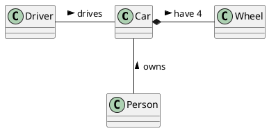

# Student information system - SCHEDULE

Modul rozvrhy slouží k vytváření a prohlížení rozvrhů. V rámci modulu jsou vedeny předměty a jejich příslušnost do studijních programů a jednotlivých semestrů studia, ve kterých jsou v rámci programu doporučeny. Dále jsou v rámci modulu vedeny učebny pro výuku a jejich kapacita. Pro každý předmět jsou evidovány rozvrhové lístky přednášek a cvičení, včetně jejich kapacit a vyučujících. Modul umožňuje rozvrhové komisi v jednotlivých semestrech vytváření centrálních rozvrhů přiřazováním rozvrhových lístků k učebnám na konkrétní den v týdnu a hodinu. Předměty ve stejném studijním programu a semestru musí být rozvrhovány tak, aby měli studenti v daném studijním programu a semestru možnost tyto předměty navštěvovat. Dále nesmí docházet k časovým kolizím jednoho učitele. Modul umožňuje vytvářet statistické reporty o vytíženosti místností v jednotlivých semestrech.  
 

## Functional Requirements
Tato sekce obsahuje funčkní požadavky.
 

### User requirements

Jakýkoli Uživatel
- zobrazit počty studentů zapsaných na předmětu
- zobrazit si statistický report
- zobrazit si seznam předmětů a rozvrhových lístků

Student
- Jako student, chci být schopen si zobrazit mnou zapsané rozvrhové lístky pro daný semestr, protože potřebuji vidět, zda-li se některé nepřekrývají.
- Jako student, chci být schopen si zobrazit předměty z mého studijního plánu, protože tyto předměty si budu primárně zapisovat.
- Jako student, chci být schopen si zobrazit detail daného rozvrhového lístku, protože potřebuji vidět detaily ohledně času, vyučujícím a místa konání.
- Jako student, chci být schopen se odepsat daný rozvrhový lístek, protože může kolidovat s jiným lístkem.
- Jako student, chci být schopen si zobrazit všechny rozvrhové lístky pro daný předmět, protože mi to pomůže si vybrat ten, který mi nejvíce vyhovuje.
- Jako student, chci být schopen si zobrazit povinné předměty pro mou specializaci, protože ty musím za své studium splnit.
- Jako student, chci být schopen si zobrazit povinně volitelné předměty, protože z nich musím určitou část splnit.

- zobrazit si předměty pro daný studijní program, semestr
- zobrazit předmety z mé fakulty, z jiných fakult
- zobrazit si rozvrhové lístky pro daný předmět a informace o nich(učebna, čas, učitel, ...)
- zapsat se do rozvrhového lístku, odepsat se z něj
- zobrazit zapsané rozvrhové lístky, kolize mezi nimi

- chce mít možnost zapsat se na předmět

- Coby student chci mít možnost prohlížet dostupné rozvrhové lístky a zapisovat si je, abych mohl řádně docházet na výuku
- Coby student chci mít možnost upravovat si zápis rozvrhových lístků (přezapisovat, odhlašovat), abych si mohl v rámci možností sestavit rozvrh
- Coby student chci mít možnost Zapsat si do rozvrhu k lístkům poznámky a vlastní virtuální lístky, abych mohl rozvrhový modul používat k plánování svých pracovních dní 

- ako student si chcem vediet prezerat rozvrh konkretneho vyucujuceho aby som sa s nim vedel dohodnut na case konzultace
- ako student si chcem vediet prezerat rozvrh konkretnej ucebne aby som videl predmety vyucovane v rovnakom arealy ako sa vtedy nachadzam
- ako student chcem byt schopny zobrazit revizi zapisaneho rozvrhu aby som sa vyhol kolizim
- ako student chcem byt schopny zapisovat predmety do kosika aby som si naplanoval vhodne rozvrh nez zacne zapis
- ako student chcem byt schopny zobrazit informace o vsetkych zapsanych predmetoch za studium aby som mal prehlad o ne/splnenych predmetoch a poctu kreditov
- ako student chcem byt schopny sa zapisat na cakaciu listinu listka aby som nemusel pravidelne kontrolovat ci sa uvolnila kapacita rozvrhoveho listka
- ako student chcem byt schopny sa odpisat z cakacej listiny listku pretoze som sa rozhodol zmenit rozvrh a listok mi don uz nevyhovuje

Učitel
- Jako učitel, chci být schopen si zobrazit mnou vyučované rozvrhové lístky pro daný semestr, protože si potřebuji podle toho naplánovat pracovní dobu.
- Jako učitel, chci být schopen si zobrazit detail rozvrhového lístku, abych se mohl podívat například na místo konání.
- Jako učitel, chci mít možnost modifikovat mnou vyučovaný rozvrhový lístek, protože někdy chci např. navýšit kapacitu.

- zobrazit můj rozvrh
- zobrazit informace o rozvrhovém lístku, který vyučuji
- zobrazit informace o místnosti(kapacita, budova, ...)
- zobrazit studenty zapsané na rozvrhovém lístku, který vyučuji
- připsat studenta na můj rozvrhový lístek, odepsat ho z něj

- chce zobrazit studenty přihlášené na předmět z mého rozvrhu
- chce mít možnost zapsat studenta na svůj předmět
- chce mít možnost posílat zprávy svým studentům

- Coby učitel chci mít možnost zobrazit si rozvrhové lístky podle místnosti, abych mohl plánovat mimořádné schůzky, předtermínové zkoušky apod.

- ako ucitel chcem byt schopny zobrazit zeznam studentu zapsanych na rozvrhovy listok aby som mohol poslat informace emailem
- ako ucitel chcem byt schopny zobrazit rozvrh studenta aby som vedel dohodnut konzultaci/presunut paralelku na iny cas v mimoriadnych pripadoch
- ako ucitel chcem byt schopny pridat studenta na rozvrhovy listok aby som pridal konkretneho studenta nad kapacitu po explicitnej dohode.

Rozvrhový komisař
- zobrazit předměty podle studijních programů
- zobrazit místnosti a informace o nich
- zobrazit seznam učitelů pro daný předmět
- zobrazit seznam učitelů a místností, které jsou volné v určitý čas
- vytvořit/upravit/smazat rozvrhový lístek s daným dnem a časem, přiřadit k němu učitele, místnost, ...
- zobrazit rozvrh jednotlivých učitelů
- zobrazit rozvrhové lístky předmětu, info o nich

- Jako člen rozvrhové komise, chci mít možnost vidět všechny rozvrhové lístky pro daného učitele, protože učitel může učit v jedné budově a přesun do jiné budovy trvá určitý čas.
- Jako člen rozvrhové komise, chci mít možnost vidět rozvrhové lístky pro daný předmět, protože potřebují mít přehled o jejich rozložení.
- Jako člen rozvrhové komise, chci mít možnost vidět všechny rozvrhové lístky pro všechny předměty doporučené pro daný ročník, protože musím zajistin, aby studenti mohli chodit na všechny předměty doporučeného plánu. 
- Jako člen rozvrhové komise, chci mít možnost modifikovat roizvrhové lístky, protože občas je potřeba změnit čas, vyučujícího, místo konání, kapacitu atd. 

Správce budov
- vytížnost jednotlivých učeben

- Coby správce budov chci mít možnost generovat a prohlížet reporty o stavu vytížení místností, protože to potřebuji k úkonům jako plánování úklidu či údržby apod.

Uživatel s rozvrhem
- ako student/ako ucitel chcem byt schopny ulozit moj rozvrh v roznych formatoch aby som ho mohol importovat do svojeho kalendara

 

### System requirements

#### Actor list
 - Uživatel s rozvrhem
   - Student
   - Učitel
 - Rozvrhový komisař
 - Správce budov

 

#### Uživatel s rozvrhem
Je uživatel systému, který má nějaký svůj rozvrh, se kterým může chtít nějak nakládat.

#### Student
Student je osoba zapsaná na univerzitě, která aktivně studuje. Tedy zapisuje se na určité rozvrhové lístky v daném semestru. Zapisuje si jak povinné, tak i povinně volitelné a volitelné předměty. Může si také zapsat předměty z jiné fakulty, než na které současně studuje.

#### Učitel
Učitel je zaměstnanec univerzity, který se nějakým způsobem podílí na výuce. Má preference ohledně času, kdy může vyučovat. Také má preferenci ohledně toho, kolik rozvrhových lístků chce vyučovat.

#### Rozvrhový komisař
Člen rozvrhové komise je zaměstnanec univerzity, jehož náplní práce je podílet se na tvorbě rozvrhů pro dané studijní plány, kontrola kolize mezi rozvrhovými lístky,
vytváření rozvrhových lístků dle preference učitelů atd.

#### Správce budov
Správce budov je zaměstnanec univerzity, který má nějakým způsobem na starosti/zodpovědnosti techicko-údržbářské práce na jedné či více univerzitních budov. Zajišťuje úklid, servis zařízení, výdej klíčů apod. 

 

### Use cases

#### Zápis na čekací listinu
- Starting situation:
Zacal sa zapis predmetov a nestihol som sa zapisat na rozvrhovy listok predmetu ktory som chcel pretoze sa rychlo naplnila kapacita.
Ked sa niekto odhlasi tak si zmenim rozvrhovy listok.
- Normal:
  1) Zapisem sa na iny - volny rozvrhovy listok 
  2) posle sa poziadavok na ulozenie info o zapisanom studentovi pre dany listok
  2) otvorim rozvrhovy listok ktory som povodne planoval zapisat
  3) kliknem na zapisat na cakaciu listinu - posle sa poziadavok
  4) system si niekam ulozi (na spravne poradie) cloveka pre dany listok
  5) system mi pri zbrazeni informacii o rozvrhovom listku bude ukazovat aktualnu kapacitu| pocet ludi na cakacke | moje poradie na cakacke
  6) system dynamicky meni informacie z bodu 4) podla chovania studentov..
  7) system pravidelne zkontroluje zmeny v ulozenych datach a ak pocet ludi ulozenych pre dany listok je < nez kapacita a niekto je na cakacej listine tak ho preradi
  8) aktualizuju sa ulozene data a zobrazovane info na stranke
  9) odosle sa email studentovi ktory bol preradeni z cakacej listiny
- What can go wrong:
  * clovek nieje zapisany na ziadny iny listok, v tom pripade ho upozornim aby sa zapisal na volny listok a neumoznim zapis na cakaciu listinu
  * clovek uz je zapisany na inej cakacej listine, vtedy ho odhlasim z povodnej cakacej listiny a prihlasim na novu 
- System state on completion:  
  Student je zapsany korektne na predmet - je zapsany na konkretny rozvrhovy listok a zaroven je priradeny na jedinu cakaciu listinu.

#### Zápis na předmět
- Počáteční stav
  - Student je přihlášen ke svému účtu v systému
- Normální situace
  - Student vyhledá předmět podle názvu, kódu, vyučujícího, ... a nebo ho nalezne na seznamu povinných předmětů pro jeho specializaci
  - Student si o předmětu zobrazí podrobnější informace včetně jeho rozvrhových lístků
  - Student po vybrání hlavního rozvrhového lístku (případně i sekundárního rozvrhového lístku pro cvičení) svůj výběr potvrdí
- Co se může pokazit
  - Požadovaný předmět není v daný semestr vyučován
  - Student nemá splněny prerekvizity
  - Požadovaný předmět má plnou kapacitu

#### Zobrazit zapsaných rozvrhových lístků pro daný semestr

- počáteční stav
  - Student je přihlášen ke svému účtu v systému

- normální situace
  - Student vyhledá předmět podle názvu, kódu, vyučujícího, ... a nebo ho nalezne na seznamu povinných předmětů pro jeho specializaci
  - Student si o rozvrhu zobrazí podrobnější informace
  - V případě, že se student rozhodne rozvrh změnit, je přesměrován na modul zápis

#### Poslání zprávy svým studentům

  - Vyučující má možnost odeslání emailu všem studentům konkrétního předmětu, který mu náleží

#### Zobrazení statistického reportu

- Počáteční stav
  - Uživatel je připojen do systému bez jakýchkoli speciálních oprávnění
- Normální situace
  - Uživatel si vyhledá předmět a vyžádá si od systému zobrazení podrobností
  - Systém načte z databáze a zobrazí uživateli podrobnosti o předmětu které obsahují i statistický report
- Po dokončení
  - Uživatel získá všechny informace ze statistického reportu předmětu

## Information model

[*Express the information model of the domain as a UML class diagram in PlantUML. Do not use class methods in the diagram, only classes, class attributes and associations connecting classes.*]

[*Document each class with a short description in a separate subsection*]

### [*Class name*]

[*Class description*]
