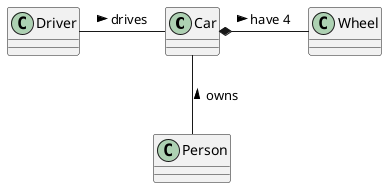

# Student information system - SCHEDULE

Modul rozvrhy slouží k vytváření a prohlížení rozvrhů. V rámci modulu jsou vedeny předměty a jejich příslušnost do studijních programů a jednotlivých semestrů studia, ve kterých jsou v rámci programu doporučeny. Dále jsou v rámci modulu vedeny učebny pro výuku a jejich kapacita. Pro každý předmět jsou evidovány rozvrhové lístky přednášek a cvičení, včetně jejich kapacit a vyučujících. Modul umožňuje rozvrhové komisi v jednotlivých semestrech vytváření centrálních rozvrhů přiřazováním rozvrhových lístků k učebnám na konkrétní den v týdnu a hodinu. Předměty ve stejném studijním programu a semestru musí být rozvrhovány tak, aby měli studenti v daném studijním programu a semestru možnost tyto předměty navštěvovat. Dále nesmí docházet k časovým kolizím jednoho učitele. Modul umožňuje vytvářet statistické reporty o vytíženosti místností v jednotlivých semestrech. 

## Functional Requirements

Jan J.
{

}

Jan S. 
{

}

Jára
{

}

Kryštof
{

}

Nicol
{

}

### User requirements
Jan J.
{

}

Jan S. 
{

}

Jára
{

}

Kryštof
{

}

Nicol
{

}

### System requirements

[*Document here your system requirements as use case diagrams.*]

#### Actors

[*Document here all actors from the use case diagrams. Make a subsection for each actor and their short description in each subsection.*]

##### [*Actor name*]

[*Actor description*]

#### Use cases

[*Document here all use cases. Create a subsection for each use case diagram. If you have only one use case diagram, you do not need a special subsection*]

##### [*Use case diagram title*]

[*Use case diagram in PlantUML*]

```plantuml
@startuml
left to right direction

@enduml
```

To be able to embed PlantUML diagrams to Markdown code with previews in VSCode you need
* Markdown All in One extension
* PlantUML extension
* Mardown Plantuml Preview extension

Follow https://plantuml.com/

[*Describe the diagram in a short paragraph. Describe each use case from the diagram in the detail from the lecture in a separate subsection.*]

###### [*Use case title*]

[*Use case description in the structure from the lecture.*]

[*Add an activity diagram for one use case per a team member*]

## Information model

[*Express the information model of the domain as a UML class diagram in PlantUML. Do not use class methods in the diagram, only classes, class attributes and associations connecting classes.*]



[*Document each class with a short description in a separate subsection*]

### [*Class name*]

[*Class description*]
